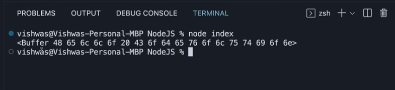

# File system in nutshull 
we talk about modules last sections ..let's talk now about the Fs module and its important rule 
-------------------------------------------------------------------
### How to use it 
```
const fs = require('fs');

```
now we will learn to read the content of the file 
###### assume that there is a file name is file.txt contain "hello world"
###### we gonna use a method called readFileSync 

```
const fs = require('fs');
const fileContent = fs.readFileSync('./file.txt');
console.log(fileContent);

```

here is the result 

---------------------------------------------------------------------------
#### NOTE: it return it in binary form 

### we will add s paramter in the method to be readable for us 

```
const fs = require('fs');
const fileContent = fs.readFileSync('./file.txt','utf-8');
console.log(fileContent);

```
##### after running the file it will return hello world

let's try readFile method 
```
const fs = require('fs');
fs.readFile('./file.txt','utf-8',(error,data)=>{
if(error){
    console.log(error);
}else{
    console.log(data);
}
});


```
### Now write some words in file !!

```
const fs = require('fs');
fs.writeFileSync('./file2.txt','OSC are geeks');
console.log(fileContent);

```
file2 will be created and it will be contained the content above 

```
const fs = require('fs');
fs.writeFile('./file.txt',"weeeeeeehh",{flag:'a'},(err)=>{
if(err){
    console.log(err);
}else{
    console.log("File written");
}
});
```
it's more preferable to use readFile ,writeFile methods 
### Question time ..........Why are they perferabel  ???  ;)


