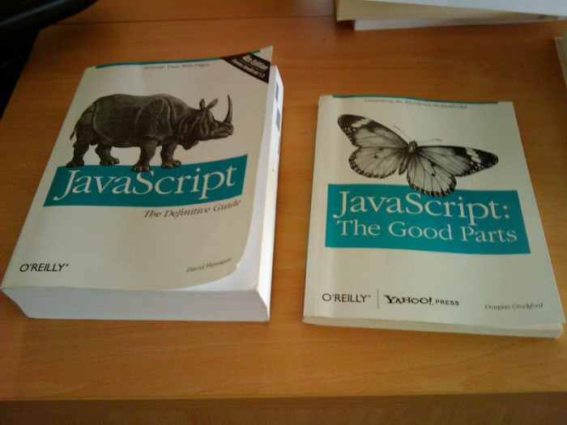
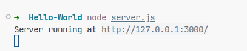
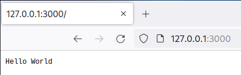

# Node.js Tutorial

- ## What is Node.js

  According to Wikipedia, "Node.js is a cross-platform, open-source server environment that can run on Windows, Linux, Unix and macOS. Node.js is a back-end JavaScript runtime environment, runs on the [V8 JavaScript engine](https://en.wikipedia.org/wiki/V8_(JavaScript_engine)), and executes JavaScript code outside a web browser".

- ## Why Node.js

  - Javascript
    > Can be a curse or a blessing depending on what language you are comfortable with.

    

  - `npm` (Node Package Manager)
      > In January 2017 over 350000 packages were reported being listed in the npm registry, making it the biggest single language code repository on Earth, and you can be sure there is a package for (almost!) everything.

  - Ability to keep data in native JSON (javascript object notation) format.
      
  - Wide range of hosting options.

  - Large userbase.
      
  - Open-source

- ## Installation

  For installation please referee to [Node.js installation guide](https://nodejs.dev/en/download/package-manager/).

- ## Hello World Application

  Example Node.js Application:

  ```javascript
  const http = require('http');

  const hostname = '127.0.0.1';
  const port = 3000;

  const server = http.createServer((req, res) => {
    res.statusCode = 200;
    res.setHeader('Content-Type', 'text/plain');
    res.end('Hello World\n');
  });

  server.listen(port, hostname, () => {
    console.log(`Server running at http://${hostname}:${port}/`);
  });
  ```

  To run this snippet, save it as a `server.js` file and run `node server.js` in your terminal.

  

  Firefox browser output:

  

  To include `http` module:

  ```javascript
  const http = require('http');
  ```

  Now your application has access to the HTTP module, and is able to create a server:

  The `createServer()` method of `http` creates a new HTTP server and returns it.

  Whenever a new request is received, the request event is called, providing two objects: a request (an `http.IncomingMessage` object) and a response (an `http.ServerResponse` object).

  Those 2 objects are essential to handle the HTTP call.

  The first provides the request details. In this simple example, this is not used, but you could access the request headers and request data.

  The second is used to return data to the caller.

  ```javascript
  server.listen(port, hostname, () => {
    console.log(`Server running at http://${hostname}:${port}/`);
  });
  ```

  The server is set to listen on the specified port and host name. When the server is ready, the callback function is called, in this case informing us that the server is running.

- ## Know Your Tools

  The Node.js [API reference documentation](https://nodejs.org/en/docs) provides detailed information about a function or object in Node.js. This documentation indicates what arguments a method accepts, the return value of that method, and what errors may be related to that method. It also indicates which methods are available for different versions of Node.js.

- ## Honorable Mention

  - ### [.NET Core](https://dotnet.microsoft.com/en-us/learn/dotnet/what-is-dotnet)

    .NET Core is a free, open-source, modular, cross-platform framework developed by Microsoft for building modern, high-performance applications. It is a reimplementation of the .NET Framework to be more lightweight, modular, and flexible.

  - ### [Go](https://go.dev/)

    Go was designed at Google in 2007 to improve programming productivity in an era of multicore, networked machines and large codebases. Useful characteristics: Static typing and run-time efficiency (like C), Readability and usability (like Python).

  - ### [Laravel](https://laravel.com/)

    Laravel is a web application framework with expressive, elegant syntax. A web framework provides a structure and starting point for creating your application, allowing you to focus on creating something amazing while we sweat the details.