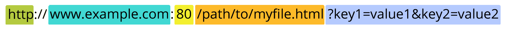

# Web Mechanics 

## URLs

With Hypertext and HTTP, URL is one of the key concepts of the Web. It is the mechanism used by browsers to retrieve any published resource on the web.

URL stands for Uniform Resource Locator. A URL is nothing more than the address of a given unique resource on the Web. In theory, each valid URL points to a unique resource. Such resources can be an HTML page, a CSS document, an image, etc. In practice, there are some exceptions, the most common being a URL pointing to a resource that no longer exists or that has moved. As the resource represented by the URL and the URL itself are handled by the Web server, it is up to the owner of the web server to carefully manage that resource and its associated URL.

### URL Anatomy

A URL is composed of different parts, some mandatory and others optional. The most important parts are highlighted on the URL below (details are provided in the following sections):

#### Scheme

The first part of the URL is the scheme, which indicates the protocol that the browser must use to request the resource (a protocol is a set method for exchanging or transferring data around a computer network). Usually for websites the protocol is HTTPS or HTTP (its unsecured version). Addressing web pages requires one of these two, but browsers also know how to handle other schemes such as mailto: (to open a mail client), so don't be surprised if you see other protocols.
#### Authority

Next follows the authority, which is separated from the scheme by the character pattern ://. If present the authority includes both the domain (e.g. www.example.com) and the port (80), separated by a colon:

- The domain indicates which Web server is being requested. Usually this is a domain name, but an IP address may also be used (but this is rare as it is much less convenient).

- The port indicates the technical "gate" used to access the resources on the web server. It is usually omitted if the web server uses the standard ports of the HTTP protocol (80 for HTTP and 443 for HTTPS) to grant access to its resources. Otherwise it is mandatory.

#### Path to resource

`/path/to/myfile.html` is the path to the resource on the Web server. In the early days of the Web, a path like this represented a physical file location on the Web server. Nowadays, it is mostly an abstraction handled by Web servers without any physical reality.
#### Parameters

`?key1=value1&key2=value2` are extra parameters provided to the Web server. Those parameters are a list of key/value pairs separated with the & symbol. The Web server can use those parameters to do extra stuff before returning the resource. Each Web server has its own rules regarding parameters, and the only reliable way to know if a specific Web server is handling parameters is by asking the Web server owner.

## HTPP Protocol

The HyperText Transfer Protocol (HTTP) is the underlying network protocol that enables transfer of hypermedia documents on the Web, typically between a browser and a server so that humans can read them.

HTTP is textual (all communication is done in plain text) and stateless (no communication is aware of previous communications). This property makes it ideal for humans to read documents (websites) on the world wide web. However, HTTP can also be used as a basis for **REST** web services from server to server

### HTPP Messages

#### Requests

An example **HTTP** request: 

Requests consist of the following elements:

 - An HTTP method, usually a verb like `GET`, `POST`, or a noun like OPTIONS or HEAD that defines the operation the client wants to perform. Typically, a client wants to fetch a resource (using `GET`) or post the value of an HTML form (using `POST`), though more operations may be needed in other cases. [Complete HTTP request methods.](https://developer.mozilla.org/en-US/docs/Web/HTTP/Methods)
 
- The path of the resource to fetch; the URL of the resource stripped from elements that are obvious from the context, for example without the protocol (http://), the domain (here, developer.mozilla.org), or the TCP port (here, 80).

- The version of the HTTP protocol.

- Optional headers that convey additional information for the servers. [Standard HTTP headers.](https://developer.mozilla.org/en-US/docs/Web/HTTP/Headers)

- A body, for some methods like `POST`, similar to those in responses, which contain the resource sent.

##### Responses

An example response:

Responses consist of the following elements:

- The version of the HTTP protocol they follow.

- A status code, indicating if the request was successful or not, and why. [Complete HTTP status code list](https://developer.mozilla.org/en-US/docs/Web/HTTP/Status).

- A status message, a non-authoritative short description of the status code.

- HTTP headers, like those for requests.

- Optionally, a body containing the fetched resource.
	
## What are APIs

API is an abbreviation for Application Programming Interface which is a collection of communication protocols and subroutines used by various programs to communicate between them. A programmer can make use of various API tools to make their program easier and simpler. Also, an API facilitates programmers with an efficient way to develop their software programs. Thus in simpler terms, an API helps two programs or applications to communicate with each other by providing them with the necessary tools and functions. It takes the request from the user and sends it to the service provider and then again sends the result generated from the service provider to the desired user. 

### REST Architecture

REST stands for Representational State Transfer, and follows the constraints of REST architecture allowing interaction with RESTful web services. It defines a set of functions (GET, PUT, POST, DELETE) that clients use to access server data. The functions used are:

- GET (retrieve a record)
- PUT (update a record)
- POST (create a record)
- DELETE (delete the record)

Its main feature is that REST API is statelessness, i.e., the servers do not save clients’ data between requests. 

##### Further Reading:

[Wikipedia](https://en.wikipedia.org/wiki/REST)
[Microsoft Docs](https://learn.microsoft.com/en-us/azure/architecture/best-practices/api-design)

## HTTP Reference Docs

### RFC Documents

Request for Comments (RFC) documents contain technical specifications and organizational notes for the Internet.

RFCs produced by the Internet Engineering Task Force (IETF) cover many aspects of computer networking. They describe the Internet's technical foundations, such as addressing, routing, and transport technologies. RFCs also specify protocols like **TLS**, **QUIC**, and **WebRTC** that are used to deliver services used by billions of people every day, such as real-time collaboration, email, and the domain name system.

Software developers, hardware manufacturers, and network operators around the world voluntarily implement and adopt the technical specifications described by RFCs.

- Link: [RFC 9110 Internet Standard](https://httpwg.org/specs/rfc9110.html#top)

### Mozilla Web Docs 

Documenting web technologies, including CSS, HTML, and JavaScript, since 2005. Resources for Developers, by Developers.

- Link: [Mozilla Web Docs](https://developer.mozilla.org/en-US/)