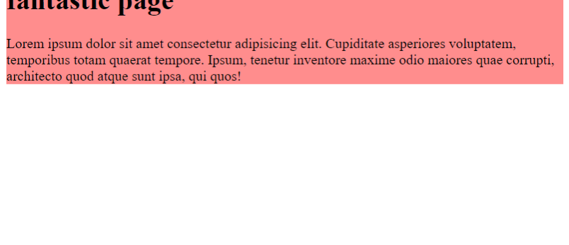

# CSS Tutorial

  Here we will learn everything about CSS, how to deal with it and Some tricks in writing it.

## Agenda

- [What is CSS?](https://github.com/nadamedhat27/Full-Stack/tree/main/Front-End/CSS#what-is-CSS)
- [Why CSS?](https://github.com/nadamedhat27/Full-Stack/tree/main/Front-End/CSS#why-css)
- [Prerequisites](https://github.com/nadamedhat27/Full-Stack/tree/main/Front-End/CSS#prerequisites)
- [How to import CSS into HTML](https://github.com/nadamedhat27/Full-Stack/tree/main/Front-End/CSS#how-to-import-css-into-html)
- [Basic Syntax](https://github.com/nadamedhat27/Full-Stack/tree/main/Front-End/CSS#basic-syntax)
- [Selectors](https://github.com/nadamedhat27/Full-Stack/tree/main/Front-End/CSS#selectors)
- [Comments](https://github.com/nadamedhat27/Full-Stack/tree/main/Front-End/CSS#comments)
- [Background](https://github.com/nadamedhat27/Full-Stack/tree/main/Front-End/CSS#background)
  
----------------------------------------------------------------

- ## What is CSS?

  - A short for Cascade Style Sheet.
  - Language to create the presentation and visuals (Fonts, Colors, Margins, Images, etc.).
  - Levels: 1, 2, 3.


----------------------------------------------------------------

- ## Why CSS?
  
  If you are looking for working as Web Designer, UI Developer or Front-End Developer then you well need CSS as a background before you get in deep with the previous job titles.

----------------------------------------------------------------

- ## Prerequisites
  
  Learn HTML, CSS is used to style the HTML structure you wrote before so, you should learn how to deal with HTML before you learn CSS.

----------------------------------------------------------------

- ## How to import CSS into HTML
  
  We have 3 methods to style the HTML with CSS or to apply our CSS styles to the HTML structure:
  
  1. **Inline Method:** We just add the style inside the target element.
      
      ```html
      <div style="background-color: blue;">
      ```

  2. **Internal Method:** We create a new element `<style>` and we add the style inside it.
      ```html
        <style>
        div {
          background-color: blue;
        } 
        </style>
      ```
  3. **External Method:** We add the path of the CSS file containing all our CSS styles inside the `<link>` element. 
      ```html 
        <link rel="stylesheet" href="path/to/the/file">
      ```
  - So, what is the difference between inline, internal and external methods?

    :arrow_right: The inline method is much more powerful than the others, if there are any conflicts between inline and other methods the inline method will win over them.

----------------------------------------------------------------

- ## Basic Syntax
  As shown above, the main syntax for writing CSS is as follows:
  
  ```
    Selector {
      Property: Value;
      another-property: Value;
    }
  ```
  So we are going to learn what are the selectors and properties and how to add values to the properties.

----------------------------------------------------------------

- ## Selectors
  Selectors are divided into 3 types:
  
  1. **Element name:** Just type the target element name and start styling.
      
      ```css
      div {
        // style
      }
      ```
      Note: if you apply any style with element name as a selector, this style will be applied to all elements with the same name, in this example above, the styling will be applied to all div elements.

  2. **Identifier:**
     - **Class name:** First you need to specify the class name for the target element in the html code and then use this class name with a `.` before it.
        ```css
        .firstclass {
          // style
        }
        ``` 
        Note: This solves the problem in the previous point, if you want to apply a styling to a specific element or a group of elements, then use classes.

     - **ID name:** Same as above, you need to specify the ID for the target element in the html code and then use this ID name with a `#` before it.
        ```css
        #firstID {
          // style
        }
        ```
     - **Important Note:** You can't start a class name or ID with a number, but instead you can use `-` or `_`, also the naming convention is special in CSS, we use kebab case, firstly, all characters are small and between different words we put a hyphen `-` like `first-class`.

  - So, what is the difference between ID and class?

    :arrow_right: The class attribute can be specified to more than one element making them as a group and we can style them all together with the same code, on the other hand, the ID attribute can be specified to a single element only and styling this ID means that we style this element only, usually, it's not the best practice to use id for styling.

  
----------------------------------------------------------------

- ## Comments

   Comments are written like:
  
    ```css
    /* 
      multi-line comment
      another comment
    */    
    ```
    This is for the one-line comments and multiple-lines comments, We write Comments when we write code that isn't completely clear or new to this language, Comments helps you and your teammates to understand your code very well.

----------------------------------------------------------------

- ## Background
  The background is a property that allows us to put a background for any element, it can be color, gradient, or simply a picture, if the background is a color then it's written like this:
  ```css 
  div {
    background-color: black;
  }
  ```
  The value of the `background-color` property can be the color name like `black` or `white`, but not all colors have names because they are counted millions, so there are two other methods to present colors:
  
  1. **RGB Method:** the value of the RGB color contains three parts the first number represents Red, and second is Green, while the third is Blue, we can add a value from `0` to `1` for the opacity and called Alpha Channel, it's written like this:
      ```css
      div {
        background-color: rgb(255, 255, 255, 0);
      }
      ```
      The value of each of the three colors is from `0` to `255`, from black to the pure color respectively, and if we write them all the highest value then we get white.
      ***
  2. **Hexadecimal Method:** this method is only a simpler way to represent colors derived from the previous method, the hexadecimal representation is a famous way to represent numbers, the decimal bit is from `0` to `9`, but the hexadecimal bit is from `0` to `f` which is `15`, and if we write `ff` we get `255`, so the first 2 bits are for Red and the second 2 bits are for Green and the last 2 bits are for Blue, also we can add 2 bits for the opacity and called Alpha Channel, it's overwhelming I know but if you want more explanation, visit [this link](https://www.mathsisfun.com/hexadecimal-decimal-colors.html), and it's written like this:
      
      ```css 
      div {
        background-color: #ffffff00;
      }
      ```
  ***
  Let's go to another property called `background-image`, by this property we can add an image to any element, written like this:
  ```css
  div {
    background-image: url("path/to/file/background.png");
  }
  ``` 
  the background image extension is preferred to be `jpg`, `png` or `jpeg`.
  ***
  The `background-repeat` property is used to repeat the image from previous property horizontally and vertically, it's default value is repeat but we cand change it to `repeat-x`, `repeat-y` or `no-repeat`, so it's written like:
  ```css 
  div {
    background-repeat: repeat;
  }
  ```
  ***
  The `background-attachment` property is used to set the background image scrollable or not, so if its value is `scroll`, so it's on a its place and if you scroll it's gone, but if it's `fixed`, it will be with you when scrolling. so it's written like:
  ```css 
  div {
    background-attachment: fixed;
  }
  ```
  ***
  The `background-position` property is used to set the position of the background image, it's value consists of two sections, the first is for distance from left and the second is for distance from top, it's written like:
  ```css
  div {
    background-position: left top;
  }
  ```
  The value we can write for the first section can be `left`, `center`, or `right`, while for the second section it can be `top`, `center`, or `bottom`, but also we can specify the position by numbers measured in `%`, `ch`, `cm`, `em`, `ex`, `fr`, `in`, `mm`, `pc`, `pt`, `px`, or `rem`. BTW the `px` is the most popular measurement used. so by `px` it's written like:
  ```css 
  div {
    background-position: 200px 100px;
  }
  ```
  ***
  The the `background-size` property is used to set the background size on the page, the value `auto` is actually the default value and the image is displayed in its original size, the value `cover` displays the image to cover all of the element it's used in (it can be stretched or cropped), the value `contain` displays the full image whatever the content is, so it's written like:
  ```css
  div {
    background-size: cover;
  }
  ``` 
  Also this property consists of two sections, the first is for width, and the second is for height (also using the measures in the previous section), so it's written like:
  ```css 
  div {
    background-size: 500px 300px;
  }
  ```

----------------------------------------------------------------

- ## The 3 Outlines
  
  
  - **Padding:** is the distance out of the content to the border.
  - **border:** is the line between padding and margin.
  - **margin:** is the distance from the border to the other element.
  
----------------------------------------------------------------

- ## Padding 
  It's written like this:
  ```css
  div {
    padding: 10px;
  }
  ```
  This means that the `10px` will be added to the padding in the four sides `top`, `right`, `bottom` and `left`, so we can write it like this:
  ```css
  div {
    padding: 10px 20px 30px 20px;
  }
  ```
  So these distances will be added to `top`, `right`, `bottom` and `left` respectively, but if we write it like this:
  ```css
  div {
    padding: 10px 20px;
  }
  ```
  The `10px` will be added to the `top` and `bottom` padding, and the `20px` will be added to the `right` and `left` padding, so every missing value will be copied from its opposite value. 
  
  BTW: you can write only 3 values if the left is same as the right.

  also we can specify the padding side by these properties:
  ```css
  div {
    padding-top: 10px;
    padding-right: 20px;
    padding-bottom: 30px;
    padding-left: 20px;
  }
  ```
  All of these properties can be specified by any measurement shown above but we can't set it to a 
  ***negative*** value.

----------------------------------------------------------------

- ## Margin
  Same as the padding property, all things explained there can be applied here, and it's written like this:
  ```css
  div {
    margin: 20px 10px 30px 15px; 
    /* 
      Same as:
      margin-top: 20px;
      margin-right: 10;
      margin-bottom: 30px;
      margin-left: 15px;
    */
  }
  ```
  But there is only one difference between the padding and the margin, we can use ***negative*** values, which means we are subtracting from the distance between the element and the other elements or generally moving our element in the page. like this:
  ```css 
  div {
    margin-top: -40px;
  }
  ```
  

----------------------------------------------------------------

- ## Border
  Same as the padding and margin property, all things explained there can be applied here, and it's written like this:

  ```css
  div {
    border-width: 10px;
    /*
      Same as:
      border-top-width: 10px;
      border-right-width: 10px;
      border-bottom-width: 10px;
      border-left-width: 10px;
    */
  }
  ```
  But here we can specify the border color like this:
  ```css
  div {
    border-color: red;
    /*
      Same as:
      border-top-color: red;
      border-right-color: red;
      border-bottom-color: red;
      border-left-color: red;
    */
  }
  ```
  And we can specify the border style like this:
  ```css
  div {
    border-style: solid;
    /*
      Same as:
      border-top-style: solid;
      border-right-style: solid;
      border-bottom-style: solid;
      border-left-style: solid;
    */
  }
  ```
  We can change the border sharpness by `border-radius` like this:
  ```css
  div {
    border-radius: 5px;
    /*
      Same as:
      border-top-radius: 5px;
      border-right-radius: 5px;
      border-bottom-radius: 5px;
      border-left-radius: 5px;
    */
  }
  ```
  Last thing we can specify the border width, style, and color by a shorthand statement like this:
  ```css
  div {
    border: 10px solid red;
  }
  ```