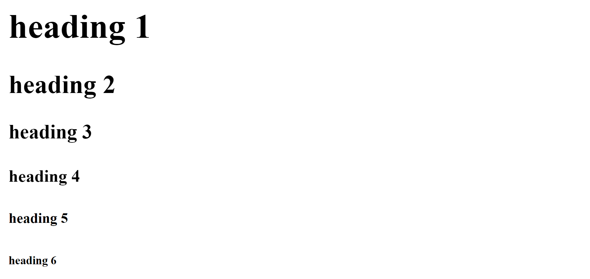
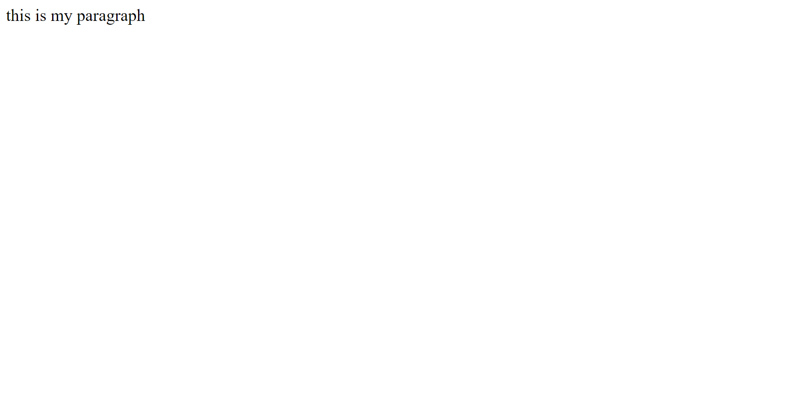
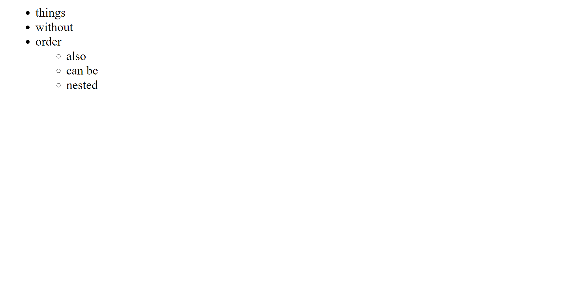
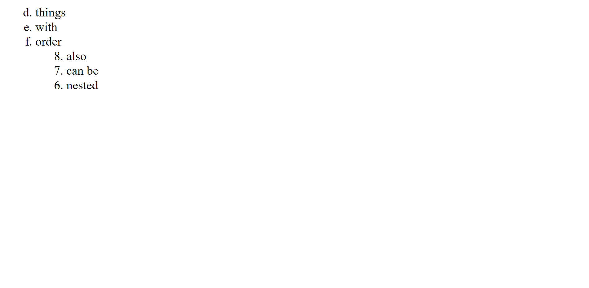
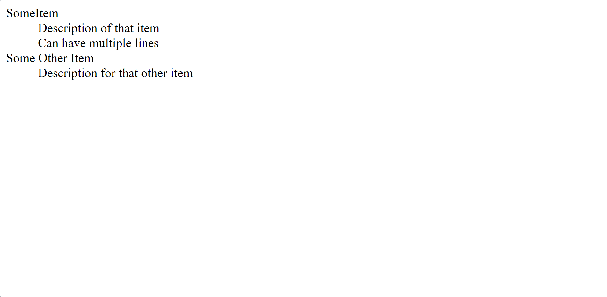
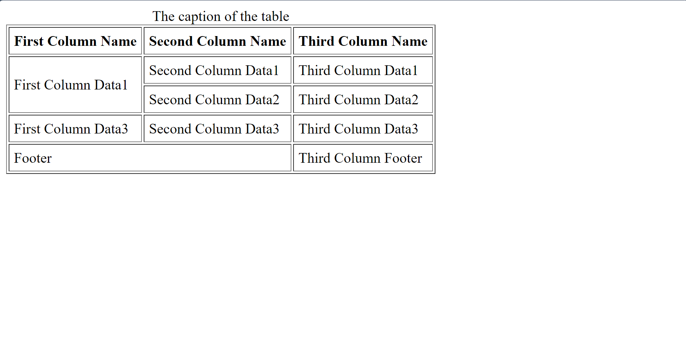
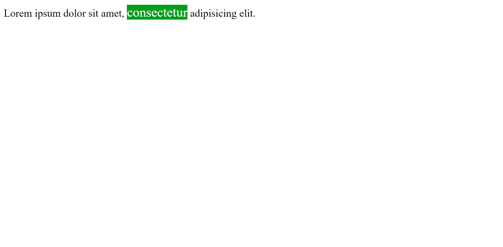
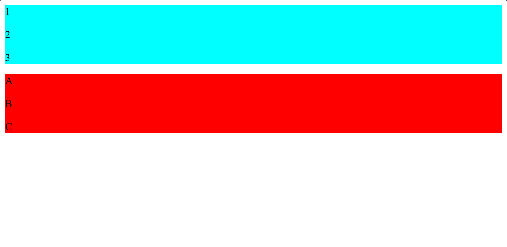
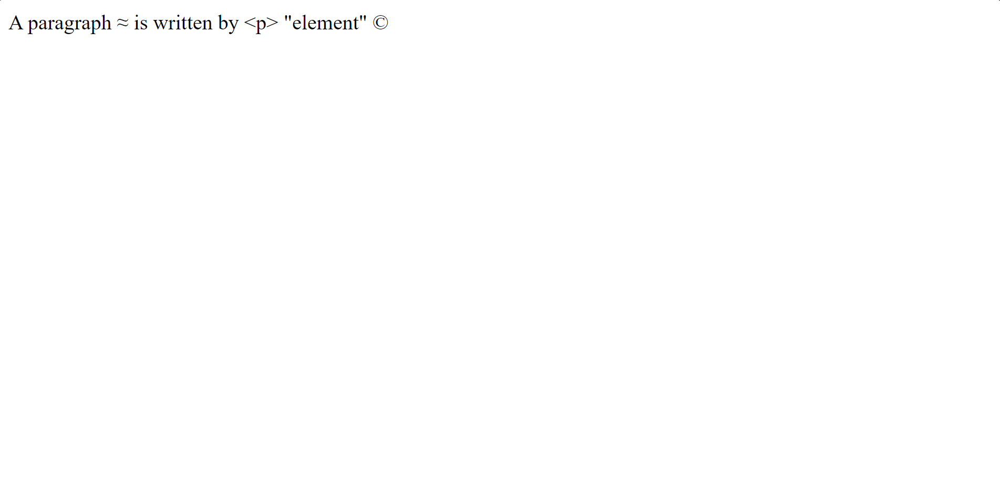
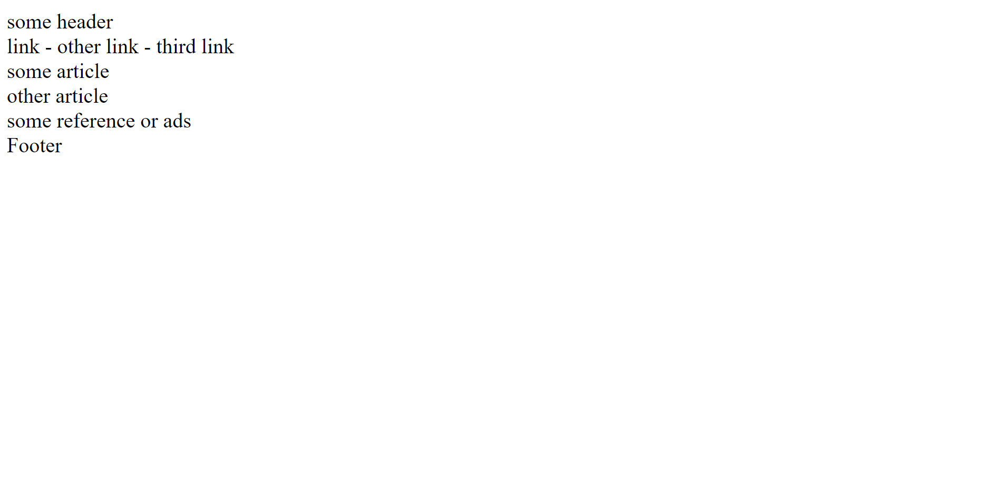

# HTML Tutorial

  Here we will learn the HTML Elements, Its types, and usage.

- ## General in writing the code

  - We can write the code in more than one line for clarity.
  - any spaces between words you write will be translated in the webPage as a single space only.

- ## General to all elements
  
  - Our code in html is case insensitive.
  - Every element has opening and closing tags like  `<html>` (opening) `</html>` (closing).
  - But there are elements that is self closed like `<meta />` and `<b />`.
  - All elements can have attributes, some of them are specialized to a specific element and the other are general to all elements.  <br />
  Some general attributes like ( name, class, id ).

  - Attributes can be added to any element like this `<element attribute="value">`, and not always we need the value.

  - No difference between single and double quotes in writing the values of attribute, both are same in the webPage, and if the value is only one word you can discard quotes.

    ```html
    <meta charset=u tf-8 />

    <meta http-equiv='X-UA-Compatible' content='IE=edge' />

    <meta name="description" content="This is my toturial, learn html easily." />
    ```

    But if we have **SPACES** in the value of an attribute, then we must use quotes (single or double).

----------------------------------------------------------------

- ## Comments

   Comments are written like:
  
    ```html
    <!-- Comments --> 
    ```

    and this for both single and multi-line comments
    and we write them when we write code that isn't completely clear or new to this language, Comments helps you and your teammates to understand your code very well.

----------------------------------------------------------------

- ## DOCTYPE
  
   DocType is not an element but it's an instruction for
    the browser, for example

    ```html
    <!DOCTYPE html>
    ```

    is referred for HTML5 standard mode and this line is important (Must be written) and without it browser will run the page in [quirks mode](https://developer.mozilla.org/en-US/docs/Web/HTML/Quirks_Mode_and_Standards_Mode).

----------------------------------------------------------------

- ## HTML Element

    The `<html>` tag is the root of any webPage.
    <br /> 
    It's written like:

    ```html
    <html>
      Some Content  
    </html> 
    ```

    it has 2 elements **ONLY** (Head and Body).

<br />

----------------------------------------------------------------

- ## Head Element

    The `<head>` element has all meta data about the page (Like Styling, Scripts, and any addition data).
    <br />
    It's written like:

    ```html
    <head>
      Some Content
    </head> 
    ```

    And now we will learn the elements written inside the Head Element.

    <br />

  ----------------------------------------------------------------

  - ### Meta Elements

      The `<meta>` tag is self closed tag that has the additional data about the webPage and insturctoins, it has some attributes (has some additional characteristics about that element) like charset or content.
      <br />
      <br />

      ```html
      <meta charset=u tf-8 />
      ```

      Here charset attribute holds the type of language you want to use (utf-8 holds English and Arabic).
      
      <br />

      ```html
      <meta name="description" content="This is my toturial, learn html easily." />

      <meta name='viewport' content='width=device-width, initial-scale=1' />
      ```

      The name attribute can be description like this which holds the description that appears in searching and under the title of the page.

      <br />

  ----------------------------------------------------------------

  - ### Title Element

      the Title element holds the title of the page that appears above in the tabs bar.
      <br />
      It's written like:

      ```html
      <title>
        Some title
      </title>
      ``` 

----------------------------------------------------------------

- ## Body Element
  
  The Body element has all contents of the webPage
  <br /> 
  like `<p>`, `<dev>` or anything

    <br />

  ----------------------------------------------------------------

  - ### Heading Elements

      Headings are ordered from h1 (Biggest) to h6 (Smallest), h1 is the first level of headings and is the biggest title and when we want to add subtitles to it we use h2 which is level 2 and so on.

      <br />

      It's written like:

      ```html
      <h1>heading 1</h1>
      <h2>heading 2</h2>
      <h3>heading 3</h3>
      <h4>heading 4</h4>
      <h5>heading 5</h5>
      <h6>heading 6</h6>
      ```

      The output is:
      <br />
      

  ----------------------------------------------------------------

  - ### Paragraph Element
  
      the `<p>` element is a Block Element that means it have special spaces above, below, right and left, like an unseen box which makes the content clear for the user to read in the webPage.
      <br />
      Is written like:

      ```html
      <p>
        Some Content
      </p>
      ```

      Examples:

      ```html
      <p class="one"> this is my paragraph </p>
      <p class='two' hidden> this is my second paragraph </p>
      ```

      The output is:
      <br />
      
      <br />
      Note: The second paragraph is not visible because it has an attribute called hidden.

  ----------------------------------------------------------------

  - ### Formatting Elements
      - the `<b>` element is for bold text and for designing text style only.
        
        Like:

        ```html
        <p id="Formatting-first-example"> This is my <b> Toturial </b>, Welcome </p>
        ```

      - the `<strong>` element is for important bold text and the user should be aware of it. 
        
        Like:
        ```html
        <p id="Formatting-second-example"> This is my <strong> Toturial </strong>, Welcome </p>
        ```
      - the `<i>` element is for italic text.
        
        Like:

        ```html
        <p id="Formatting-third-example"> This is my <i> Toturial </i>, Welcome </p>
        ```

      - the `<em>` element is for important italic text. 
        
        Like:
      
        ```html
        <p id="Formatting-fourth-example"> This is my <em> Toturial </em>, Welcome </p>
        ```  
        
        the difference between `<i>` and `<em>` is the same difference between `<strong>` and `<b>`.

      - the `<mark>` element is for marked text.
        
        Like:

        ```html
        <p id="Formatting-fifth-example"> This is my <mark> Toturial </mark>, Welcome </p>
        ``` 

      - the `<u>` element is for underlined text.
        
        Like:

        ```html
        <p id="Formatting-sixth-example"> This is my <u> Toturial </u>, Welcome </p>
        ``` 

      - the `<small>` element is for the text that we don't want the user to concentrate on but still it should exist there like "Copyrights".
        
        Like:

        ```html
        <p id="Formatting-seventh-example"> <small> Copyright </small> </p>
        ``` 

      - the `<del>` element is for deleted text and is used to show some text that was wrong and you corrected it , like discounts.
        
        Like:

        ```html
        <p id="Formatting-eighth-example"> This is my <del> Toturial </del> Course, Welcome </p>
        ``` 

      - the `<ins>` element is for inserted text and is used to show some new added text.

          Like:

        ```html
        <p id="Formatting-ninth-example"> This is my <ins> Course </ins>, Welcome </p>
        ```

      - the `<sub>` element is subscript like atoms number in a compound.

        Like:
        ```html
        <p id="Formatting-tenth-example"> NH<sub>3</sub> </p>
        ```

      - the `<sup>` element is superscript like Power. 
        
        Like:
        ```html
        <p id="Formatting-eleventh-example"> 2<sup>3</sup> = 8 </p>
        ``` 

  ----------------------------------------------------------------

  - ### Anchors 
      the `<a>` element can hold an anchor or link to another page, it's inline element
      Format:

      ```html
      <a href="link to be added">link text</a>
      ``` 
            
      Example:
      ```html
      <a id="Anchor-first-example" href="https://www.amazon.eg/" target="_blank" title="a link to amazon website">amazon</a>
      ```
      
      the attribute target describes were to open this link.

      the attribute title is a global attribute that appears when hover that element.

      In href attribute you can put a local link in your pc.

      ```html
      <a id="Anchor-second-example" href="test.html" target="_blank" title="a link to test.html">Test</a>
      ```
      
      If you put an email address the link well open any mail application to contact this email address.

      ```html
      <a id="Anchor-third-example" href="mailto:someEmail@gmail.com" title="Contact Me">Contact</a>
      ```

  ----------------------------------------------------------------

  - ### Images

    the `` element is for adding images to the page, it's inline element.

    Format:
    ```html 
    
    ```
    
    - external link: 

    ```html
    
    ```
    you can use two attributes (Width and Height) but I don't recommend that, the better is to customize them in CSS.

    - local path:  

    ```html
    
    ```

    We just added the folder name that is besides the html file on the left then the name of the image after it including the extension (.png).
    
    - what if my image is outside the folder holding the html file? 
    
    ```html
    
    ```

    But not a good choice to make it like that.

  ----------------------------------------------------------------

  - ### Lists 
    it's a block elements
 
    1- UnOrdered List : Created by element `<ul>` and inside it some list items `<li>`.
    
    ```html
    <ul id="List-first-example">
      <li>things</li>
      <li>without</li>
      <li>order
        <ul>
          <li>also</li>
          <li>can be</li>
          <li>nested</li>
        </ul>
      </li>
    </ul>
    ```
    Output:

    

    2- Ordered List : Created by element `<ol>` and inside it some list items `<li>`.
      
    ```html
    <ol id="List-second-example" type="a">
      <li value="4">things</li>
      <li>with</li>
      <li>order
        <ol reversed start="8">
          <li>also</li>
          <li>can be</li>
          <li>nested</li>
        </ol>
      </li>
    </ol>
    ```

    Output:

    

      - attribute reversed : reverses the order of the list items.
  
      - attribute start : starts the list numbers from specific number.
       
      - attribute value : you can put a value in first `<li>` element to start from specific value by it's index.
          
      - attribute type : specifies the type of the list numbering.
 
        types : ( 1 [Numeric], A [Alphabetical Capital Letters], a [Alphabetical Small Letters], I [Romanichal Capital Letters], i [Romanichal Small Letters]).

      - lists can be nested.
       
    3- Description List : Created by element `<dl>` and used for writing a list with description for every item.

    ```html
    <dl id="List-third-example">
      <dt> SomeItem </dt>
      <dd> Description of that item </dd>
      <dd> Can have multiple lines</dd>
      <dt> Some Other Item </dt>
      <dd> Description for that other item </dd>
    </dl>
    ```

    Output:

    

      inside it:
 
      1- `<dt>` (Data Title) : for identifying the item.

      2- `<dd>` (Data Details) : for identifying the details for that item.
  

  ----------------------------------------------------------------

  - ### Tables 

    it's a block element
      
    - the `<table>` element is used to make a table in the web page, it's a block element.
      
    Format:
    
    ```html
    <table class="Tables-first-example" border="1" cellpadding="5px">
      <thead>
        <caption> The caption of the table </caption>
        <tr>
          <th> First Column Name </th>
          <th> Second Column Name </th>
          <th> Third Column Name </th>
        </tr>
      </thead>
      <tbody>
        <tr>
          <td rowspan="2"> First Column Data1 </td>
          <td> Second Column Data1 </td>
          <td> Third Column Data1 </td>
        </tr>
        <tr>
          <td> Second Column Data2 </td>
          <td> Third Column Data2 </td>
        </tr>
        <tr>
          <td> First Column Data3 </td>
          <td> Second Column Data3 </td>
          <td> Third Column Data3 </td>
        </tr>
      </tbody>
      <tfoot>
        <tr>
          <td colspan="2"> Footer </td>
          <td> Third Column Footer </td>
        </tr>
      </tfoot>
    </table>
    ```

    Output:

    
    - SubElements (All is optional but recommended for organizing the table):
     
        - `<thead>` : is for adding header to the table.
        
        - `<tbody>` : is for adding data to the table.
        
        - `<tfoot>` : is for adding footer to the table.
        
        - `<caption>` : is for adding some caption to the table, it's like a title that explains what the table is about.

    - SubSubElements:
 
      - `<th>` : is for adding header to the table, it makes the header in a special formatting from the rest rows.

      - `<tr>` : is for adding a new row.
        
      - `<td>` : is for adding data in that row depending on the number of columns expected.
        
    - Attributes (not recommended because it has alternates in CSS):

      + border : for making a border.

      + cellpadding : for making a padding.

    - Merging :

      - Columns : remove all of the columns that should be merged except one then write the attribute colspan and the number of these columns.

      - Rows : remove all of the rows that should be merged except one then write the attribute rowspan and the number of these rows. 


  ----------------------------------------------------------------

  - ### Span Element
 
    It's inline element.
    
    Is used when you want to style a word or a part of a div or any content.
            
    Format: 

    ```html
    content <span> middle content </span> other content
    ```
    Example:

    ```html
    <p>Lorem ipsum dolor sit amet, <span style="color: rgb(255, 255, 255);font-size: 20px; background-color: rgb(0, 158, 26);">consectetur</span> adipisicing elit.</p>
    ```

    Output:

    


  ----------------------------------------------------------------

  - ### Break Element
    
    It's a Self closing tag (Empty tag).

    Is used to make a new line in the paragraph or any content.

    Format: 

    ```html   
    content <br /> other content
    ```
    
    Or

    ```html
    content <br> other content 
    ```

    Example:

    ```html
    <p> Lorem ipsum,<br /> dolor sit amet consectetur adipisicing elit.</p>
    ```


  ----------------------------------------------------------------

  - ### Horizontal Rule 
    
    It's a block element and it's a self closing tag (Empty tag).
    
    Is used to make a horizontal line between elements
    Format: `<hr>` or `<hr />`.


  ----------------------------------------------------------------

  - ### Divisions
 
    Is a block element
    
    Is used to contain other elements that are related to each other and make your favorite styling on it without repetition.

    You can use classes and ids to specify each div.

    Example: 

    ```html
    <div class="Numbers" style="background-color: aqua;">
        <p> 1 </p>
        <p> 2 </p>
        <p> 3 </p>
    </div>

    <div class="Alphabets" style="background-color: rgb(255, 0, 0);">
        <p> A </p>
        <p> B </p>
        <p> C </p>
    </div>
    ```

    Output: 

    


  ----------------------------------------------------------------

  - ### Entities

    It's a method to print any tag or any special character like it was written in the code
    - `<` : `&lt;`
    - `>` : `&gt;`
    - `&` : `&amp;`
    - also `&asymp;` -> &asymp; ,  `&copy;` -> &copy;,  `&quot;` -> &quot; and more.. 

    Examble:

    ```html
    <div> A paragraph &asymp; is written by &lt;p&gt; &quot;element&quot; &copy;</div>
    ```

    Output:

    


  ----------------------------------------------------------------

  - ### Semantic Elements
    From HTML5 and all of them are block elements.

    They are elements that can specify what the content is more than divisions by only one word and without the need of classes like divisions.

    - in the previous if you want to create navigation bar :
      ```html
      <div class="nav"> content </div>
      ```
    - but now you can just type :
      ```html
      <nav> content </nav>
      ```

    And then, you can style it easily and quickly without any conflicts and there is more than the examples below.
    
    Note: they are not different in performance they just have specific name, I mean the elements in the example below will not be styled at all. 

    ```html
    <header> some header </header>
    <nav> link - other link - third link</nav>
    <section>
        <section>
            <article>
                some article
            </article>
            <article>
                other article
            </article>
        </section>
        <aside>
            some reference or ads
        </aside>
    </section>
    <footer> Footer </footer>
    ```

    Output: 

    

----------------------------------------------------------------

- ## Dev Break :blush:

  Let's Make some Simple page with divisions and classes only.

  ```html
  <div class="header">
        <h2> Logo </h2>
        <ul>
            <li> Home </li>
            <li> About </li>
            <li> Contact </li>
            <li> Favorites </li>
            <li> For You </li>
        </ul>
    </div>
    <hr>
    <div class="navigation">
        <ul>
            <li>link</li>
            <li>link</li>
            <li>link</li>
            <li>link</li>
            <li>link</li>
            <li>link</li>
            <li>link</li>
        </ul>
    </div>
    <hr>
    <div class="content">
        <div class="figure">
            
            <p> Some Caption </p>
        </div>
    </div>
    <div class="sidebar"> SideBar </div>
    <hr>
    <div class="footer"> Footer </div>
    ```

    If you see here, we need to provide a class for everty section of the page.

    Output: 

    .png)

    Now, Let's make the same simple page using semantic elements.

    ```html
    <header>
        <h2> Logo </h2>
        <ul>
            <li> Home </li>
            <li> About </li>
            <li> Contact </li>
            <li> Favorites </li>
            <li> For You </li>
        </ul>
    </header>
    <hr>
    <nav>
        <ul>
            <li>link</li>
            <li>link</li>
            <li>link</li>
            <li>link</li>
            <li>link</li>
            <li>link</li>
            <li>link</li>
        </ul>
    </nav>
    <hr>
    <section>
        <figure>
            
            <figcaption> Some Caption </figcaption>
        </figure>
    </section>
    <aside> SideBar </aside>
    <hr>
    <footer> Footer </footer>
    ```

    Here, by using the semantic elements we decreased our usage of the classes and the code now is more simple.

    Output: 

    .png)

    And also, the final view is the same. So, using semantic elements is very important.