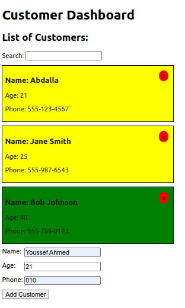
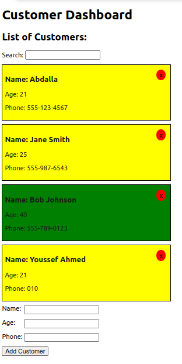
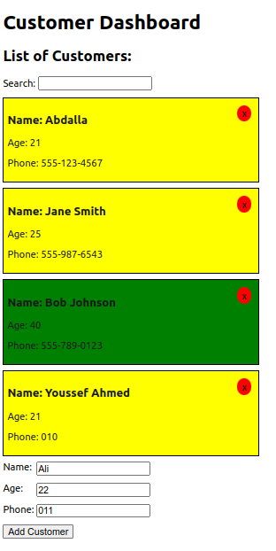
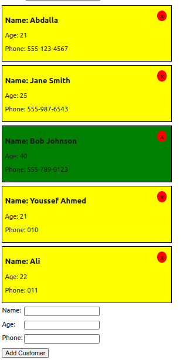

# React.js Tutorial Session 7

- ## Forms

  ### 1. Controlled Components:

  In React, form elements like `<input>` and `<textarea>` typically maintain their own state based on user input. However, React also supports a pattern called `controlled components` where form data is handled by React state.

  `App.js:`

  ```javascript
  import React, { useState } from "react";
  import CardList from "../CardList";
  import { v4 as uuid } from "uuid";
  import "./app.css";
  import AddCustomer from "../AddCustomer/AddCustomer";

  export function App() {
    // State for managing customers data
    const [customers, setcustomers] = useState([
      { id: uuid(), name: "Abdalla", phone: "555-123-4567" },
      { id: uuid(), name: "Jane Smith", age: 25, phone: "555-987-6543" },
      { id: uuid(), name: "Bob Johnson", age: 40, phone: "555-789-0123" },
    ]);

    // handle click events on customer cards to delete it
    const handleClick = (id) => {
      setcustomers(customers.filter((customer) => customer.id !== id));
    };

    // filter customers based on search filter
    const fillCustomers = (filter) => {
      return filter
        ? customers.filter((customer) =>
            customer.name.toLowerCase().includes(filter)
          )
        : customers;
    };

    // add a new customer
    const add = (customer) => {
      setcustomers([...customers, { id: uuid(), ...customer }]);
    };

    return (
      <>
        <CardList customers={fillCustomers} handleClick={handleClick} />
        {/* Rendering the AddCustomer component and passing the add function as prop */}
        <AddCustomer add={add} />
      </>
    );
  }

  export default App;
  ```

  `AddCustomer:`

  ```javascript
  import React, { useState } from "react";
  import "./AddCustomer.css";

  const AddCustomer = ({ add }) => {
    // State for managing form inputs
    const [customer, setCustomer] = useState({
      name: "",
      age: "",
      phone: "",
    });

    return (
      // Form element with a submit event handler
      <form onSubmit={(e) => e.preventDefault()}>
        <div className="dataContainer">
          <label htmlFor="name">Name:</label>
          <input
            id="name"
            type="text"
            value={customer.name}
            // Event handler to update customer name in state
            onChange={(e) => setCustomer({ ...customer, name: e.target.value })}
          />
        </div>
        <div className="dataContainer">
          <label htmlFor="age">Age:</label>
          <input
            id="age"
            type="number"
            value={customer.age}
            // Event handler to update customer age in state
            onChange={(e) => setCustomer({ ...customer, age: e.target.value })}
          />
        </div>
        <div className="dataContainer">
          <label htmlFor="phone">Phone:</label>
          <input
            id="phone"
            type="text"
            value={customer.phone}
            // Event handler to update customer phone in state
            onChange={(e) =>
              setCustomer({ ...customer, phone: e.target.value })
            }
          />
        </div>
        <button
          type="submit"
          onClick={() => {
            add(customer);
            setCustomer({ name: "", age: "", phone: "" });
          }}
        >
          Add Customer
        </button>
      </form>
    );
  };

  export default AddCustomer;
  ```

  Output:

  

  

  - #### State Management:

    1. The customer state object is initialized using the useState hook to manage the form inputs' values.

    2. Each property of the customer state object (`name`, `age`, `phone`) corresponds to the value of an input field.

  - #### Value:

    1. `value={customer.name}` sets the value of the name input field to the name property of the customer state object.

  - #### onChange Event Handler:

    1. An `onChange` event handler is provided for each input field.

    2. When the user types into an input field, this event handler is triggered.

    3. Inside the event handler, the `setCustomer` function is called to update the `customer` state object.

    4. The spread operator (`...`) is used to create a copy of the `customer` state object, and then the corresponding property (`name`, `age`, `phone`) is updated with the new value entered by the user (`e.target.value`).

  By managing the input field values via state and updating them through the `onChange` event handler, the input fields become controlled components. This means that their values are controlled by React state, making it easy to track and manage the form's state and behavior.

  ***

  ### 2. Uncontrolled Components:

  Alternatively, you can use `uncontrolled components` where form data is handled by the DOM itself. This is less common in React but can be useful in certain situations.

  `AddCustomer:`

  ```javascript
  import React, { useRef } from "react";
  import "./AddCustomer.css";

  const AddCustomer = ({ add }) => {
    // Create refs to store references to input fields
    const nameRef = useRef();
    const ageRef = useRef();
    const phoneRef = useRef();

    return (
      // Form element with a submit event handler
      <form
        onSubmit={(e) => {
          e.preventDefault(); // Prevent default form submission behavior

          // Retrieve values from input fields using refs
          const name = nameRef.current.value;
          const age = ageRef.current.value;
          const phone = phoneRef.current.value;

          // Call the add function with the customer data
          add({ name, age, phone });
          // Clear input fields after submission
          nameRef.current.value = "";
          ageRef.current.value = "";
          phoneRef.current.value = "";
        }}
      >
        <div className="dataContainer">
          <label htmlFor="name">Name:</label>
          <input id="name" type="text" ref={nameRef} />
        </div>
        <div className="dataContainer">
          <label htmlFor="age">Age:</label>
          <input id="age" type="number" ref={ageRef} />
        </div>
        <div className="dataContainer">
          <label htmlFor="phone">Phone:</label>
          <input id="phone" type="text" ref={phoneRef} />
        </div>
        <button type="submit">Add Customer</button>
      </form>
    );
  };

  export default AddCustomer;
  ```

  Output:

  

  

  - #### Ref Usage:

    1. The component uses useRef hooks to create references (`nameRef`, `ageRef` and `phoneRef`) for the input elements (`<input>`).

    2. Refs are used to directly access the DOM nodes of the input fields, without relying on React state to manage their values.

  - #### Form Submission Handling:

    1. When the form is submitted (`onSubmit` event), the event handler function calls `e.preventDefault()` to prevent the default form submission behavior, which would cause a page reload.

    2. Inside the event handler, the current values of the input fields are accessed directly from the DOM nodes using the refs (`nameRef.current.value`, `ageRef.current.value` and `phoneRef.current.value`).

  - #### No State Management:

    1. Unlike controlled components where form data is managed by React state, in uncontrolled components, the form data is managed by the DOM itself.

    2. The component does not store or manage the input values in React state. Instead, it directly accesses the input values from the DOM using refs.

  - #### Direct DOM Manipulation:

    1. After retrieving the input values, the component resets the input fields by directly manipulating their DOM nodes (`nameRef.current.value = ""`, `ageRef.current.value = ""` and `phoneRef.current.value = ""`).

  It relies on direct manipulation of DOM elements and does not manage form data using React state. Instead, it uses refs to access input values directly from the DOM.

  ***

  ### 3. Form Libraries:

  React also has numerous form libraries such as Formik, React Hook Form, and Redux Form, which provide additional features like validation, error handling, and easier form management.

  ***
