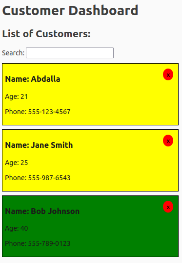
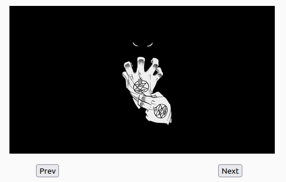

# React.js Tutorial Session 6

* ## useState

    * In React, the `useState` hook is used to add state to functional components. The `useState` hook returns an array with two elements: the current state value and a function that allows you to update the state. Here's a simple example:
      
        ```javascript
      // Import the useState hook from the 'react' library
      import React, { useState } from "react";
      import CardList from "../CardList";
      import { v4 as uuid } from "uuid";
      import "./app.css";
      
      export function App() {
        // Use the useState hook to manage the 'customers' state
        const [customers, setcustomers] = useState([
          { id: uuid(), name: "Abdalla", phone: "555-123-4567" },
          { id: uuid(), name: "Jane Smith", age: 25, phone: "555-987-6543" },
          { id: uuid(), name: "Bob Johnson", age: 40, phone: "555-789-0123" },
          // Add more customer objects as needed
        ]);
      
        // Use the useState hook to manage the 'filter' state
        const [filter, setfilter] = useState("");
      
        // Function to delete a customer based on their ID
        const handleClick = (id) => {
          setcustomers(customers.filter((customer) => customer.id !== id));
        };
      
        // Function to update the 'filter' state based on a given word
        const handleChange = (word) => {
          setfilter(word);
        };
      
        // Function to filter customers based on the 'filter' state
        const fillCustomers = () => {
          return filter
            ? customers.filter((customer) =>
                customer.name.toLowerCase().includes(filter)
              )
            : customers;
        };
      
        // Render the CardList component with filtered customers
        return (
          <CardList
            customers={fillCustomers()}
            handleClick={handleClick}
            handleChange={handleChange}
          />
        );
      }
      
      export default App;

        ```
         The output is:
       <br />
       
       * `customers`: This state variable is initialized with an array of customer objects. The `useState` hook returns an array with two elements. The first element (`customers`) is the current state value, and the second element (`setcustomers`) is a function used to update the state.
       * `filter`: This state variable is initialized with an empty string. It represents the filter term used for filtering customers based on their names.
       `setfilter`: Similar to the previous example, this function is used to update the state of the `filter` variable.
      * `deleteCustomer`: This function takes an `id` parameter and uses the `setcustomers` function to update the state of `customers`. It filters out the customer with the specified `id` from the array.
   
      * `filterCustomers`: This function takes a `word` parameter and uses the `setfilter` function to update the state of `filter`. It sets the filter term to the provided `word`.
      * The `fillCustomers` function is used to filter the `customers` array based on the current filter term.
      * The `deleteCustomer`, `filterCustomers` and `fillCustomers` are a functions passed as props to the `CardList` component.
   * Another example:
 
     ```javascript
     import React, { useState } from "react";
      
     const SlideShow = () => {
       // Use the useState hook to manage the state of indexOfImg
      // The initial value of indexOfImg is set to 1
      let [indexOfImg, setIndexOfImg] = useState(1);
      
       function next() {
         // If indexOfImg is less than 5 increment it otherwise reset to 1
         indexOfImg < 5 ? setIndexOfImg(indexOfImg + 1) : setIndexOfImg(1);
       }
      
       const prev = () => {
         // If indexOfImg is greater than 1 decrement it otherwise set to 5
         indexOfImg > 1 ? setIndexOfImg(indexOfImg - 1) : setIndexOfImg(5);
       };
      
      return (
        <div style={{ margin: "0 auto", width: "350px", marginTop: "20px" }}>
          {/* Display an image based on the current value of indexOfImg */}
          
      
         <div
            style={{
              width: "80%",
              margin: "0 auto",
              marginTop: "15px",
              display: "flex",
              justifyContent: "space-between",
            }}
          >
          <button onClick={prev}>Prev</button>
      
            <button style={{ marginRight: "10px" }} onClick={next}>
            Next
            </button>
          </div>
        </div>
       );
      };
      
     export default SlideShow;
        ```
        The output is:
       <br />
       
     * `let [indexOfImg, setIndexOfImg] = useState(1);`: Using the `useState` hook to create a state variable `indexOfImg` and its updater function `setIndexOfImg`. The initial value of `indexOfImg` is set to 1.
  * Another example:
    
      ```javascript
      import React, { useState } from "react";
      import Card from "./Card/Card";
      
      function CardList({ customers, handleClick, handleChange }) {
        const [word, setword] = useState("");
        return (
          <div>
            <h1>Customer Dashboard</h1>
            <div>
              <h2>List of Customers:</h2>
              <label htmlFor="filter">Search: </label>
              <input
                id="filter"
                type="text"
                value={word}
                onChange={(e) => {
                  setword(e.target.value);
                  handleChange(e.target.value.toLowerCase());
                }}
              />
              {customers.map((customer) => (
                // For each customer in the customers array, create a div with a unique key
                <div key={customer.id}>
                  {/* Render the Card component and spread the customer object as props */}
                  <Card {...customer} handleClick={handleClick} />
                </div>
              ))}
            </div>
          </div>
        );
      }
      
      export default CardList;
     ```
      * `const [word, setword] = useState("")` initializes the state variable `word` with an initial value of an empty string (`""`).
      * The `<input>` element is associated with the state variable `word` for its value and is controlled by React.
      * Inside the event handler, `setword(e.target.value)` is called to update the state with the entered text.
