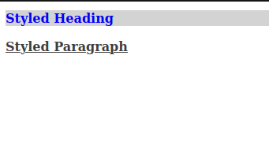
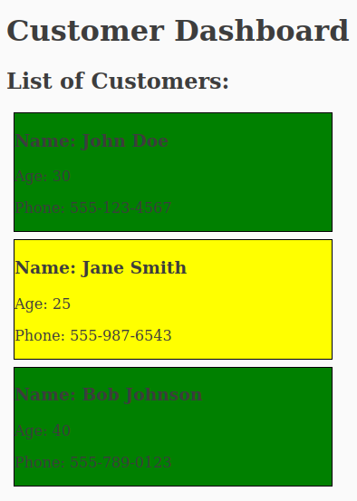
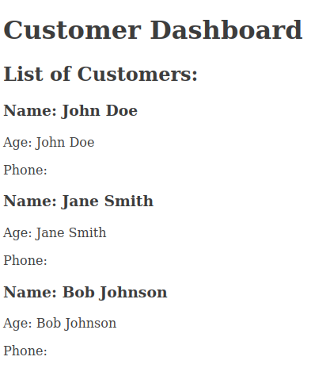
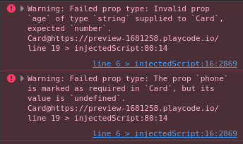

# React.js Tutorial Session 4

* ## Fragment

    * In JSX (JavaScript XML), the "fragment" is a concept used to group multiple elements without introducing an additional parent element in the DOM. Fragments are particularly useful when you need to return multiple elements from a component's render method, but you want them to be encapsulated without introducing an extra div or other container element.

    * You can use the `<React.Fragment>` syntax or the shorthand `<>...</>` to create fragments. Here's how you can use fragments in JSX
    * Using `<React.Fragment>`:
        ```javascript
        import React from 'react';
    
        function MyComponent() {
          return (
            <React.Fragment>
              <h1>Hello</h1>
              <p>This is a paragraph.</p>
            </React.Fragment>
          );
        }
        ```
    * Using the shorthand `<>...</>`:
        ```javascript
        import React from 'react';
    
        function MyComponent() {
          return (
            <>
              <h1>Hello</h1>
              <p>This is a paragraph.</p>
            </>
          );
        }
        ```
        
        The output is:
            <br />
            
            
----------------------------------------------------------------
* ## Styling
  * ### Inline Style
    * In React, you can apply inline styles to components using the `style` attribute. The `style` attribute allows you to set the CSS properties and values directly within your JSX code. Here's an example of how to use inline styles in a React component:
      
        ```javascript
        import React from 'react';
        
        const MyComponent = () => {
          // Define an inline style object
          const myInlineStyle = {
            color: 'blue',        // CSS property and value
            fontSize: '16px',     // CSS property and value
            backgroundColor: 'lightgray' // CSS property and value
          };
        
          return (
            <div>
              <h1 style={myInlineStyle}>Styled Heading</h1>
              <p style={{ fontWeight: 'bold', textDecoration: 'underline' }}>Styled Paragraph</p>
            </div>
          );
        };
        
        export default MyComponent;
      ```
        The output is:
          <br />
          
  * ### CSS Classes
    * In React, you can add CSS classes to components using the className attribute. This attribute allows you to specify one or more CSS classes for a component, and it's commonly used to style components. Here's how to add CSS classes to React components:
      
        ```javascript
        import React from 'react';
        import './MyComponent.css'; // Import your CSS file
        
        function MyComponent() {
          return (
            <div>
              {/* Add CSS classes to the component */}
              <div className="custom-class">This is a styled component</div>
              <div className="another-class">Thicomponents is another styled component</div>
            </div>
          );
        };
        
        export default YourComponent;
      ```
        
  * ### CSS Modules
    * By using CSS Modules, each component gets its own unique set of class names, and you can use those class names as properties of the imported styles object to apply the styles locally within your component. Here's how to add CSS modules to React components:
      
      ```CSS
      /* MyComponent.module.css */
      .myComponent {
        color: blue;
      }
      
      .button {
        background-color: green;
      }
      ```
      
        ```javascript
      import React from 'react';
      import styles from './MyComponent.module.css';
      
      function MyComponent() {
          return (
            <div>
              <h1 className={styles.myComponent}>Styled Heading</h1>
              <button className={styles.button}>Styled Button</button>
            </div>
          );
      }
      
      export default MyComponent;
      ```
        The output is:
          <br />
          
----------------------------------------------------------------
* ## Fetch data inside JSX with map
  1. We define an array called `customers`, where each element is an object representing a customer with `name`, `age`, and `phone` properties.
  2. Inside the component, we use the `map` function to iterate over the `customers` array. For each customer object, we create a list item `<li>` with the customer's information displayed.
  3. The `key` property is assigned to each list item for efficient rendering and to ensure that React can keep track of individual list items.


        ```javascript
        import React from 'react';

      function CustomerList() {
        const customers = [
          { name: 'John Doe', age: 30, phone: '555-123-4567' },
          { name: 'Jane Smith', age: 25, phone: '555-987-6543' },
          { name: 'Bob Johnson', age: 40, phone: '555-789-0123' },
          // Add more customer objects as needed
        ];
      
        return (
          <div>
            <h2>List of Customers:</h2>
            <ul>
              {customers.map((customer, index) => (
                <li key={index}>
                  <p>Name: {customer.name}</p>
                  <p>Age: {customer.age}</p>
                  <p>Phone: {customer.phone}</p>
                </li>
              ))}
            </ul>
          </div>
        );
      }
      
      export default CustomerList;
        ```
        The output is:
          <br />
          
----------------------------------------------------------------
* ## Component Props
  * In React, "props" is short for "properties," and they are a fundamental concept for passing data from one component to another. Props are used to send information from a parent component to a child component. Here's an explanation of props in React:
    
    1. **Passing Data:** Props allow you to pass data, or more precisely, values and objects, from a parent component to a child component. This is a way to share information between components in a React application.
    2. **Immutable:** Props are immutable, which means that a child component cannot modify the values it receives through props. They are read-only, ensuring that data is passed down from parent to child in a controlled manner.
    3. **Component Reusability:** Props enable the creation of reusable components. By passing different sets of props to the same component
    4. **Rendering Dynamic Content:** You can use props to render dynamic content within a component. For example, rendering a list of items or displaying user-specific information.
   * Here's an example of a parent component passing data to a child component using props:
     * ParentComponent.js:
       
        ```javascript
        import React from 'react';
        import Card from './Card'; // Import the Card component
        
        function App() {
          const customers = [
            { name: 'John Doe', age: 30, phone: '555-123-4567' },
            { name: 'Jane Smith', age: 25, phone: '555-987-6543' },
            { name: 'Bob Johnson', age: 40, phone: '555-789-0123' },
            // Add more customer objects as needed
          ];
        
          return (
            <div>
              <h1>Customer Dashboard</h1>
              <Card customers={customers} /> {/* Pass the customers list as a prop */}
            </div>
          );
        }
        
        export default App;
        ```

     * ChildComponent.js:
         ```javascript
         import React from 'react';

        // Define a Card component that takes a list of customers as props
        function Card({ customers }) {
          return (
            <div>
              <h2>List of Customers:</h2>
              {customers.map((customer, index) => (
                <div key={index} className="card">
                  <h3>Name: {customer.name}</h3>
                  <p>Age: {customer.age}</p>
                  <p>Phone: {customer.phone}</p>
                </div>
              ))}
            </div>
          );
        }
        
        export default Card;
        ```

         The output is:
          <br />
          
     * Now you can use this `Card` component by passing a list of customers as a prop when rendering it in your main application.
----------------------------------------------------------------
* ## Conditional Rendering
   * You can create a conditional rendering of styles in the Card component based on the age of the customers.
        Here's how you can achieve conditional styling based on age in the `Card` component:
      
      ```CSS
      /* YourComponent.css */
      .older, .younger{
        border: 1px solid black;
        margin: 8px;
        width: 350px;
      }
      .older {
        background-color: green;
      }
      
      .younger {
        background-color: yellow;
      }
      ```
      ```javascript
      import React from 'react';
      import './card.css';

      function Card({ customers }) {
        return (
          <div>
            <h2>List of Customers:</h2>
              {customers.map((customer, index) => (
                <div key={index} className={customer.age >= 30 ? 'older' : 'younger'}>
                  <h3>Name: {customer.name}</h3>
                  <p>Age: {customer.age}</p>
                  <p>Phone: {customer.phone}</p>
                </div>
              ))}
          </div>
        );
      }
      
      export default Card;
      ```
      The output is:
       <br />
       
--------------------------------------------------------------------------------------------------------------------------------
* ## uuid
   * `uuid` library is commonly used in React to generate unique identifiers. These unique identifiers are often used as keys for elements in lists, ensuring that each element has a distinct identity. Let's look at a simple example using React code:
     
      ```javascript
      import React from 'react';
      import Card from './Card';
      import { v4 as uuid } from 'uuid'; // Import the v4 function from the uuid library
      
      function CardList({ customers }) {
        return (
          <div>
            <h1>Customer Dashboard</h1>
            <div>
              <h2>List of Customers:</h2>
              {customers.map((customer) => (
                // For each customer in the customers array, create a div with a unique key
                <div key={uuid()}>
                  {/* Render the Card component and spread the customer object as props */}
                  <Card {...customer} />
                </div>
              ))}
            </div>
          </div>
        );
      }
      
      export default CardList;
      ```
--------------------------------------------------------------------------------------------------------------------------------
* ## PropTypes
   * `PropTypes` is a library in React that allows you to specify the types of data expected for each prop in a React component. It helps catch bugs related to incorrect data types or missing props during development.
        ```javascript
      import React from 'react';
      import PropTypes from 'prop-types';
      
      function Card({ name, age, phone }) {
          return (
            <div>
              <h3>Name: {name}</h3>
              <p>Age: {name}</p>
              <p>Phone: {phone}</p>
            </div>
          );
      }
      
      export default Card;
      
      // Define PropTypes for the Card component to specify the expected prop types
      Card.propTypes = {
        // Expecting a string for the 'name', required
        name: PropTypes.string.isRequired,
        // Expecting a number for the 'age' (optional)
        age: PropTypes.number,
        // Expecting a string for the 'phone', required
        phone: PropTypes.string.isRequired,
      };
      ```
      The output is:
       <br />
      
      
