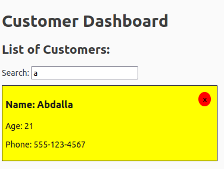
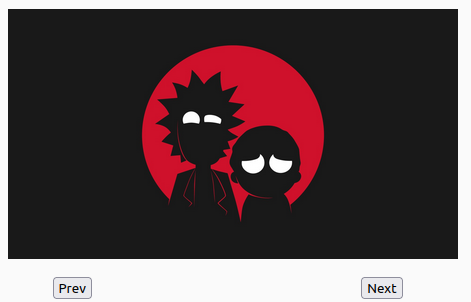

# React.js Tutorial Session 5

* ## Events

    * In React, events are interactions or occurrences that happen in the user interface, such as clicking a button, typing in an input field, or hovering over an element. Here's a simple example:
      
        ```javascript
         // Import the useState hook from the 'react' library
         import React, { useState } from "react";
         import CardList from "../CardList";
         import { v4 as uuid } from "uuid";
         import SlideShow from "../SlideShow";
         import "./app.css";
         
         export function App() {
           // Use the useState hook to manage the 'customers' state
           const [customers, setcustomers] = useState([
             { id: uuid(), name: "Abdalla", phone: "555-123-4567" },
             { id: uuid(), name: "Jane Smith", age: 25, phone: "555-987-6543" },
             { id: uuid(), name: "Bob Johnson", age: 40, phone: "555-789-0123" },
             // Add more customer objects as needed
           ]);
         
           // Use the useState hook to manage the 'filter' state
           const [filter, setfilter] = useState("");
         
           // Function to delete a customer based on their ID
           const handleClick = (id) => {
             setcustomers(customers.filter((customer) => customer.id !== id));
           };
         
           // Function to update the 'filter' state based on a given word
           const handleChange = (word) => {
             setfilter(word);
           };
         
           // Function to filter customers based on the 'filter' state
           const fillCustomers = () => {
             return filter
               ? customers.filter((customer) =>
                   customer.name.toLowerCase().includes(filter)
                 )
               : customers;
           };
         
           // Render the CardList component with filtered customers
           return (
             <>
               <CardList
                 customers={fillCustomers()}
                 handleClick={handleClick}
                 handleChange={handleChange}
               />
               <SlideShow />
             </>
           );
         }
         
         export default App;

        ```
        The output when search by a with deleted customer by button is:
       <br />

       
        *  The input element is used for filtering customers based on the entered text.
        *  The `value` attribute of the input is set to the `word` state.
        *  The `onChange` event is triggered when the input value changes, updating the `word` state and calling the `handleChange` prop.
     *  Another exapmle:
       
          ```javascript
         import React, { useState } from "react";
   
         const SlideShow = () => {
           // Use the useState hook to manage the state of indexOfImg
           // The initial value of indexOfImg is set to 1
           let [indexOfImg, setIndexOfImg] = useState(1);
         
           function next() {
             // If indexOfImg is less than 5 increment it otherwise reset to 1
             indexOfImg < 5 ? setIndexOfImg(indexOfImg + 1) : setIndexOfImg(1);
           }
         
           const prev = () => {
             // If indexOfImg is greater than 1 decrement it otherwise set to 5
             indexOfImg > 1 ? setIndexOfImg(indexOfImg - 1) : setIndexOfImg(5);
           };
         
           return (
             <div style={{ margin: "0 auto", width: "450px", marginTop: "20px" }}>
               {/* Display an image based on the current value of indexOfImg */}
               
         
               <div
                 style={{
                   width: "80%",
                   margin: "0 auto",
                   marginTop: "15px",
                   display: "flex",
                   justifyContent: "space-between",
                 }}
               >
                 <button onClick={prev}>Prev</button>
         
                 <button style={{ marginRight: "10px" }} onClick={next}>
                   Next
                 </button>
               </div>
             </div>
           );
         };
   
         export default SlideShow;
           ```
        The output when clicked on next button is:
        <br />

        
          * Two button elements are rendered, one for "Prev" and one for "Next".
          * The `onClick` event handlers are attached to these buttons, triggering the corresponding functions (`prev` or `next`) when the buttons are clicked.
          * The `next` function increments `indexOfImg` if it is less than 5 otherwise it resets it to 1.
          *  The `prev` function decrements `indexOfImg` if it is greater than 1 otherwise it sets it to 5.

