# React.js Tutorial Session 9

- ## React Hooks

  - React Hooks are functions that let you use state and other React features in functional components. They were introduced to allow developers to use state and other lifecycle features without writing a class component.

  ### 1. useEffect:

  `App:`

  ```javascript
  import { useState, useEffect } from "react";

  function App() {
    const [data, setData] = useState([]);
    const [isLoading, setIsLoading] = useState(false);

    useEffect(() => {
      setIsLoading(true);
      fetch("https://jsonplaceholder.typicode.com/users")
        .then((response) => response.json())
        .then((data) => setData(data))
        .catch((error) => console.error("Error fetching data:", error.message))
        .finally(() => setIsLoading(false));
    }, []); // Empty dependency array means this runs once on mount

    if (isLoading) {
      return <div>Loading...</div>;
    }

    return (
      <div>
        <h1 className="text-center">Data</h1>
        <ul>
          {data.map((item) => (
            <li key={item.id}>{item.name}</li>
          ))}
        </ul>
      </div>
    );
  }

  export default App;
  ```

  Output:

  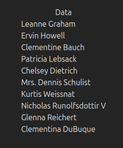

  - **Empty Dependency Array (`[]`):** The effect runs only once, after the initial render.

  `App:`

  ```javascript
  import { useState, useEffect } from "react";

  function App() {
    const [count, setCount] = useState(0);

    useEffect(() => {
      document.title = `You clicked ${count} times`;
    }, [count]); // Dependency array [count] means this runs every time count changes

    return (
      <div>
        <p>You clicked {count} times</p>
        <button
          className="bg-[#0000002c] p-2 rounded-md"
          onClick={() => setCount(count + 1)}
        >
          Click me
        </button>
      </div>
    );
  }

  export default App;
  ```

  Output:

  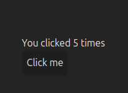

  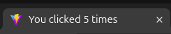

  - **Non-Empty Dependency Array:** The effect runs after the initial render and whenever any value in the dependency array changes.

  `App:`

  ```javascript
  import { useState, useEffect } from "react";

  function App() {
    const [seconds, setSeconds] = useState(0);

    useEffect(() => {
      const interval = setInterval(() => {
        setSeconds((prevSeconds) => prevSeconds + 1);
      }, 1000);

      // Cleanup function
      return () => clearInterval(interval);
    }, []); // Empty dependency array means this runs once on mount and cleans up on unmount

    return (
      <div className="bg-[#0000002c] rounded-lg  p-5">
        <p>Timer: {seconds} seconds</p>
      </div>
    );
  }

  export default App;
  ```

  Output:

  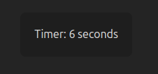

  - When you return a function from your useEffect callback, React treats it as a cleanup
    function.

  - React runs the cleanup function to clean up the previous effect before executing the new one.

  ***

  ### 2. useReducer:

  `App:`

  ```javascript
  import { useEffect, useReducer } from "react";

  const intialState = { data: [], isLoading: false, count: 0 };
  const reducer = (state, action) => {
    console.log("action", action);

    switch (action.type) {
      case "LoadingData":
        return { ...state, isLoading: true };
      case "LoadedData":
        return { ...state, data: action.payload, isLoading: false };
      case "Increment":
        return { ...state, count: state.count + 1 };
      default:
        throw new Error("Invalid action type");
    }
  };
  function App() {
    const [{ data, isLoading, count }, dispatch] = useReducer(
      reducer,
      intialState
    );

    useEffect(() => {
      dispatch({ type: "LoadingData" });
      fetch("https://jsonplaceholder.typicode.com/users")
        .then((response) => response.json())
        .then((data) => dispatch({ type: "LoadedData", payload: data }))
        .catch((error) => console.error("Error fetching data:", error.message));
    }, []);

    useEffect(() => {
      document.title = `You clicked ${count} times`;
    }, [count]);

    if (isLoading) {
      return <div>Loading...</div>;
    }

    return (
      <div>
        <h1 className="text-center">Data</h1>
        <ul>
          {data.map(({ id, name }) => (
            <li key={id}>{name}</li>
          ))}
        </ul>
        <br />
        <p>You clicked {count} times</p>
        <button
          className="bg-[#0000002c] p-2 rounded-md"
          onClick={() => dispatch({ type: "Increment" })}
        >
          Click me
        </button>
      </div>
    );
  }

  export default App;
  ```

  Output:

  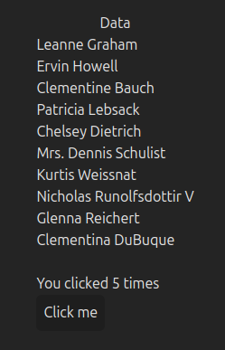

  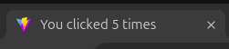

  - #### Initial State:

    - `data:` An empty array to store user data fetched from an API.

    - `isLoading:` A boolean flag to indicate if data is currently being fetched.

    - `count:` A number to keep track of how many times a button has been clicked.

  - #### Reducer Function:

    - **"LoadingData":** Sets `isLoading` to `true` to indicate that data is being fetched.
    - **"LoadedData":** Updates `data` with the fetched data and sets `isLoading` to `false` once the data is loaded.
    - **"Increment":** Increases the `count` by 1 when the button is clicked.

    - **Default:** Throws an error if the action type is not recognized.

  ***

  ### 3. useCallback:

  `App:`

  ```javascript
  import { useState, useCallback, useEffect } from "react";

  function App() {
    const [count, setCount] = useState(0);

    // Memoize the callback
    const increment = useCallback(() => {
      console.log("increment called");
      setCount((prevCount) => prevCount + 1);
    }, []); // No dependencies, so the function is created once

    useEffect(() => {
      console.log("increment function created");
    }, [increment]);

    return (
      <div>
        <p>Count: {count}</p>
        <button className="bg-[#0000002c] rounded-md p-2" onClick={increment}>
          Increment
        </button>
      </div>
    );
  }

  export default App;
  ```

  Output:

  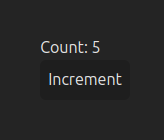

  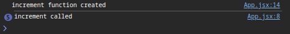

  - **Memoization:** `useCallback` is used to memoize the `increment` function. Since the dependency array is empty (`[]`), `increment` is created only once and will not be recreated on subsequent renders.

  - **Dependency on `increment`:** The `useEffect` hook logs when the `increment` function is created. Since `increment` is memoized, this effect will only run when `increment` changes. Given that `increment` has no dependencies, it should only log once when the component mounts.

  `App:`

  ```javascript
  import { useState, useCallback, useEffect } from "react";

  function App() {
    const [count, setCount] = useState(0);
    const [step, setStep] = useState(1);

    // Memoize the callback
    const increment = useCallback(() => {
      console.log("increment called");
      setCount((prevCount) => prevCount + Number(step));
    }, [step]); // Dependency on 'step', so the function is recreated when 'step' changes

    useEffect(() => {
      console.log("increment function created");
    }, [increment]);

    return (
      <div>
        <p>Count: {count}</p>
        <button className="bg-[#0000002c] rounded-md p-2" onClick={increment}>
          Increment
        </button>
        <input
          className="ml-2 text-black p-2 rounded-md"
          type="text"
          value={step}
          onChange={(e) => setStep(e.target.value)}
        />
      </div>
    );
  }

  export default App;
  ```

  Output:

  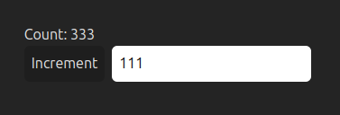

  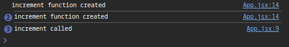

  - The `increment` function depends on `step`. It will only be recreated if `step` changes, ensuring the function is not recreated on every render.

  - The effect runs whenever the `increment` function changes. Since `increment` is memoized with `useCallback`, this effect will only log the creation message when `increment` changes, which typically happens when step changes.

  `App:`

  ```javascript
  import { useState, useCallback, useEffect, memo } from "react";

  // Child component wrapped with memo to prevent unnecessary re-renders
  // only re-renders when click increment button or change the step value that changes the increment function
  const Child = memo(function Child({ onClick }) {
    console.log("Child rendered");
    return (
      <button className="bg-[#0000002c] rounded-md p-2 w-fit" onClick={onClick}>
        Increment
      </button>
    );
  });

  function App() {
    console.log("Parent rendered");

    const [count, setCount] = useState(0);
    const [step, setStep] = useState(1);
    const [toggle, setToggle] = useState(false);

    // Memoize the increment callback to prevent it from being recreated on every render
    const increment = useCallback(() => {
      console.log("increment called");
      setCount((prevCount) => prevCount + Number(step));
    }, [step]); // Only recreate the function when 'step' changes

    const handleToggle = () => {
      setToggle((prevToggle) => !prevToggle);
      console.log("Toggle clicked");
    };

    // Log message when the increment function is created
    useEffect(() => {
      console.log("increment function created");
    }, [increment]);

    return (
      <div className="flex flex-col gap-2">
        <p>Count: {count}</p>
        <Child onClick={increment} />
        <div>
          <input
            className="mr-2 text-black p-2 rounded-md"
            type="text"
            value={step}
            onChange={(e) => setStep(e.target.value)}
          />
          <button
            className="bg-[#0000002c] rounded-md p-2"
            onClick={handleToggle}
          >
            Toggle
          </button>
        </div>
        {toggle ? <p>ON</p> : <p>OFF</p>}
      </div>
    );
  }

  export default App;
  ```

  Output:

  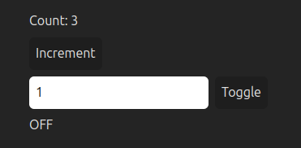

  

  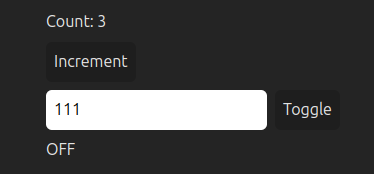

  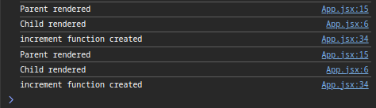

  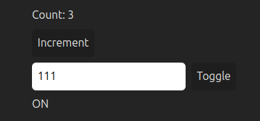

  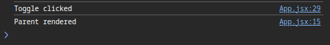

  - The `memo` function in React is a higher-order component that prevents a component from re-rendering if its props haven't changed. This can help optimize performance by avoiding unnecessary renders.

  - The `Child` component is wrapped with `memo`. This means the `Child` component will only re-render if its props change.

  - In this case, the `Child` component will only re-render if the `onClick` function (`increment`) changes. Since `increment` is memoized with `useCallback`, it will only change when `step` changes.

  Together, `useCallback` and `memo` work to optimize rendering:

  - `useCallback` ensures that the `increment` function is stable between renders unless its dependency (`step`) changes.

  - memo ensures that the `Child` component only re-renders when its props change. Since `increment` is stable, the `Child` component avoids unnecessary re-renders.

  ***
