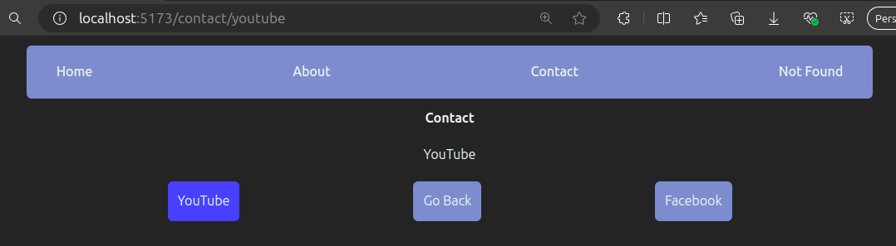
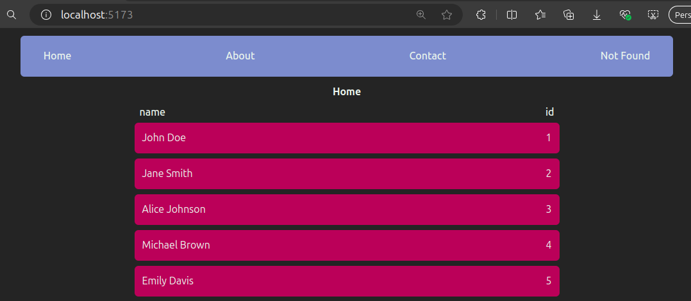

# React.js Tutorial Session 8

- ## React Router

  - React Router is a popular library for managing client-side routing in React applications.

  - It allows you to create complex, multi-page web applications that feel like traditional websites while still being single-page applications (SPAs).

  - With React Router, you can define and manage routes, enabling users to navigate through different views of your application without having to request a new HTML page from the server.

  ### 1. Components:

  - `<BrowserRouter>:` A router that uses the history API to keep UI in sync with the URL.

  - `<Routes>:` A component that groups together a set of routes.

  - `<Route>:` Defines a single route. It specifies a path and the component that should be rendered when the path matches the current URL.

  - `<Link>:` A component that enables navigation to different routes in the application without refreshing the page.

  - `<NavLink>:` A special version of the Link component that can style itself as "active" when its route matches the current URL.

  - `<Outlet>:` A placeholder for rendering child routes (nested routes).

    `App:`

    ```javascript
    import { BrowserRouter, Route, Routes } from "react-router-dom";
    import NavBar from "./NavBar";
    import Home from "./Home";
    import About from "./About";
    import Contact from "./Contact";
    import NotFound from "./NotFound";

    function App() {
      return (
        <BrowserRouter>
          <NavBar />
          <Routes>
            <Route path="/" element={<Home />} />
            <Route path="/about" element={<About />} />
            <Route path="/contact" element={<Contact />} />
            <Route path="*" element={<NotFound />} />
          </Routes>
        </BrowserRouter>
      );
    }

    export default App;
    ```

    `NavBar:`

    ```javascript
    import { Link } from "react-router-dom";

    const NavBar = () => {
      return (
        <nav>
          <ul className="font-medium w-3/4 my-3 mx-auto bg-[#7796CB] py-5 px-9 rounded-md flex justify-between">
            <li>
              <Link to="/">Home</Link>
            </li>
            <li>
              <Link to="/about">About</Link>
            </li>
            <li>
              <Link to="/contact">Contact</Link>
            </li>
            <li>
              <Link to="/any">Not Found</Link>
            </li>
          </ul>
        </nav>
      );
    };

    export default NavBar;
    ```

    Output:

    

  - #### BrowserRouter:

    - Acts as the container for the routing functionality. It listens for changes in the URL and renders the corresponding components.

  - #### NavBar:

    - Included outside of the `Routes` component so that it appears on all pages.

  - #### Routes:

    - Contains `Route` elements that define the paths and corresponding components to render.

    - `path="/":` Renders the `Home` component when the URL path is `/`.

    - `path="/about":` Renders the `About` component when the URL path is `/about`.

    - `path="/contact":` Renders the `Contact` component when the URL path is `/contact`.

    - `path="\*":` Catches all undefined routes and renders the `NotFound` component.

  - #### Link:
    - A component from React Router used to create navigational links that change the URL without causing a full page reload. Each `Link` corresponds to a route defined in the `App` component.

  ***

  ### 2. Nested Routes:

  Nested routes in React Router allow you to define routes within other routes, providing a way to create a hierarchical routing structure.

  `App:`

  ```javascript
  import { BrowserRouter, Navigate, Route, Routes } from "react-router-dom";
  import NavBar from "./NavBar";
  import Home from "./Home";
  import About from "./About";
  import Contact from "./Contact";
  import NotFound from "./NotFound";
  import YouTube from "./YouTube";
  import Facebook from "./Facebook";

  function App() {
    return (
      <BrowserRouter>
        <NavBar />
        <Routes>
          <Route index element={<Home />} />
          <Route path="contact" element={<Contact />}>
            <Route index element={<Navigate replace to="youtube" />} />
            {/* <Route index element={<YouTube />} /> */}
            <Route path="youtube" element={<YouTube />} />
            <Route path="facebook" element={<Facebook />} />
          </Route>
          <Route path="about" element={<About />} />
          <Route path="*" element={<NotFound />} />
        </Routes>
      </BrowserRouter>
    );
  }

  export default App;
  ```

  `Contact:`

  ```javascript
  import { NavLink, Outlet, useNavigate } from "react-router-dom";

  const Contact = () => {
    const navigate = useNavigate();
    return (
      <div className="font-bold flex items-center flex-col">
        <p>Contact</p>
        <Outlet />
        <div className="font-normal w-1/2 flex justify-between">
          <NavLink className="bg-[#7796CB] rounded-md p-3" to="youtube">
            YouTube
          </NavLink>
          <button
            className="bg-[#7796CB] rounded-md p-3"
            onClick={() => {
              navigate(-1);
            }}
          >
            Go Back
          </button>
          <NavLink className="bg-[#7796CB] rounded-md p-3" to="facebook">
            Facebook
          </NavLink>
        </div>
      </div>
    );
  };

  export default Contact;
  ```

  Output:

  

  - #### Routes:

    - `Route index element={<Navigate replace to="youtube" />}:` This redirects the user to the `/contact/youtube` path if they visit `/contact`.

    - `Route path="youtube" element={<YouTube />}:` This renders the `YouTube` component when the path is `/contact/youtube`.

    - `Route path="facebook" element={<Facebook />}:` This renders the `Facebook` component when the path is `/contact/facebook`.

    - `Navigate`: This component is used to redirect the default path (`index`) under `Contact` to `"/contact/youtube"`.

  - #### `useNavigate:`

    This hook is used to programmatically navigate to different routes.

  - #### `<NavLink>:`

    This component is used to create links that are aware of the routing context and apply styling when active.

  - #### `<button>:`

    This button uses the `navigate` function to go back one step in the browser history when clicked.

  - #### `Outlet:`
    This component is used in the Contact component to render the matched nested route component. It acts as a placeholder for the nested routes' content.

  ***

  ### 3. Route Parameters Binding:

  Route Parameters Binding in React Router refers to the way in which dynamic segments of the URL are mapped to component props, allowing components to access data directly from the URL. This is particularly useful for routes that need to handle specific data, like user IDs, product IDs, or other dynamic content.

  `App:`

  ```javascript
  import { BrowserRouter, Navigate, Route, Routes } from "react-router-dom";
  import NavBar from "./NavBar";
  import Home from "./Home";
  import About from "./About";
  import Contact from "./Contact";
  import NotFound from "./NotFound";
  import YouTube from "./YouTube";
  import Facebook from "./Facebook";
  import Item from "./Item";

  function App() {
    return (
      <BrowserRouter>
        <NavBar />
        <Routes>
          <Route index element={<Home />} />
          <Route path="/:id" element={<Item />} />
          <Route path="contact" element={<Contact />}>
            <Route index element={<Navigate replace to="youtube" />} />
            {/* <Route index element={<YouTube />} /> */}
            <Route path="youtube" element={<YouTube />} />
            <Route path="facebook" element={<Facebook />} />
          </Route>
          <Route path="about" element={<About />} />
          <Route path="*" element={<NotFound />} />
        </Routes>
      </BrowserRouter>
    );
  }

  export default App;
  ```

  `Home:`

  ```javascript
  import { Link } from "react-router-dom";

  const dummyData = [
    { id: 1, name: "John Doe" },
    { id: 2, name: "Jane Smith" },
    { id: 3, name: "Alice Johnson" },
    { id: 4, name: "Michael Brown" },
    { id: 5, name: "Emily Davis" },
    { id: 6, name: "David Wilson" },
    { id: 7, name: "Sarah Miller" },
    { id: 8, name: "James Taylor" },
  ];

  const Home = () => {
    return (
      <>
        <p className="font-bold mx-auto w-fit">Home</p>
        <div className="p-2 flex-col w-1/2 mx-auto flex">
          <div className="flex justify-between px-2">
            <p className="font-medium">name</p>
            <p className="font-medium">id</p>
          </div>
          {dummyData.map(({ id, name }) => (
            <Link
              to={`${id}?name=${name}`}
              key={id}
              className="bg-[#AF125A] rounded-md my-1 flex p-3 justify-between"
            >
              <p>{name}</p>
              <p>{id}</p>
            </Link>
          ))}
        </div>
      </>
    );
  };

  export default Home;
  ```

  `Item:`

  ```javascript
  import { useParams, useSearchParams } from "react-router-dom";

  const Item = () => {
    const { id } = useParams();
    const [searchParams] = useSearchParams();
    return (
      <div className="mx-auto text-center">
        <p>
          <strong>Id:</strong> {id}
        </p>
        <p>
          <strong>Name:</strong> {searchParams.get("name")}
        </p>
      </div>
    );
  };

  export default Item;
  ```

  Output:

  

  

  - `/:id` is a dynamic route segment that will capture whatever value is placed in the URL at that position and make it available to the `Item` component.

  - The `to` prop in the `Link` component uses a template string to include both the ID (`${id}`) and the name as a query parameter (`?name=${name}`).

  - `useParams:` This hook is used to access the dynamic route parameter (`id`). In the URL `/1?name=John%20Doe`, `useParams` will give you `id` as `1`.

  - `useSearchParams:` This hook is used to access the query parameters. In the URL `/1?name=John%20Doe`, `useSearchParams` will give you the value of `name` as `John Doe`.
  ***
