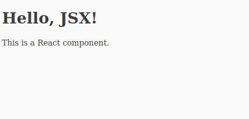

# React.js Tutorial 

* ## What is React?
  A JavaScript library for building user interfaces which includes:
    * Styles.
    * Interactive.
    * Data Manipulation.
    * Forms.
    * Animations.
      
  All of these things are encapsulated in the system by a **State**

* ## State (Life Cycle)
  In information technology and computer science, a system is described as stateful if it is designed to remember preceding events or user interactions; the remembered information is called the state of the system. Then these data will be rerendered in the whole page.

* ## Virtual DOM 
  `DOM` -> Document Object Model
  
  This is the document created by the browser containing all HTML tags and CSS statements in the page as objects and there is 2 types: the virtual DOM and the real DOM.

  The virtual DOM is a captured copy of the page.

  The real DOM is the actual represented page.

  React is working with the virtual DOM and when any change occurs on the virtual DOM it changes the changed part only in the real DOM without the need to rerender the whole page and that helps in improving performance.

* ## Strength Points
  * **Pure JavaScript.** It is easy to learn React from JavaScript Knowledge only.
  * **Declarative Programming.** In React, You make interactive UIs by changing the state of the components and React takes care of updating the DOM according to it.

    Difference between diclarative and imparative More References to explain this point:
    
    [YouTube Video](https://youtu.be/DXqX7hnTcUU?list=PLejc1JbD4ZFSaQIFNstRIrbm_fqb12Q59)
    
    [Stack OverFlow Question](https://stackoverflow.com/questions/33655534/difference-between-declarative-and-imperative-in-react-js#:~:text=Imperative%20code%20instructs%20JavaScript%20on%20how%20it%20should%20perform%20each%20step.&text=React%20is%20declarative%20because%20we,us%20to%20our%20desired%20result)
    * more readable: Program that is easier to read because it hides the lower level detail. In declarative programming we don't even know about the lower details of the system.
    * easier to reason about: The code we write is easier to reason about because it is much abstracted and we describe the solution instead of procedure.
  * **Component-Based.** The page is divided into components and every component is standalone. also we can use the same component in different places in the website without rewriting it every time.

* ## So, Why React?
  * Easy to learn.
  * SPA (Single Page Application) System / Offline / PWA (Progressive Web App).
  * Every where (Web, Mobile, Xbox, Microsoft Windows App.... etc.)
  * Supporting JS eco system.
  * Big Names! There are many famous Brands Using React (Netflix, TikTok, Twitch, Nike, Tencent, Uber, Hilton, ... etc.)

* ## Installation
  - *Online Method:* If your internet connection is poor, you can use ([CodeSandbox](https://codesandbox.io/s/new) (Recommended), [CodePen](https://codepen.io/pen?&editors=0010&layout=left), [StackBlitz](https://stackblitz.com/edit/react-azzyyt?file=src%2FApp.js))

    All these websites are shared and your code will be visible for all website users. 
  
  - *Local Method:*  
      1. Download Node.js from [Node.js](https://nodejs.org/en)
      2. Make sure it is installed by typing on the command line or the terminal and must be greater than or equal 8.10.
          ```
          node -v
          ```
          Output:
          
      3. also the npm version and must be greater than or equal 5.6.
          ```
          npm -v
          ``` 
          Output:
          
      
      4. If npm is not installed type in the terminal
          ```
          npm install npm@latest -g
          ``` 

* ## File structure
    * **node_modules**: This folder contains all the dependencies required for your project. It's generated by package managers like npm or Yarn.

    * **public**: This directory houses static assets and the main HTML file for your application. It's the entry point to your app.

    * **src**: This is where your application's source code lives. It's the most critical part of your project's structure.

        * **components**: This directory contains your reusable React components. It's often organized by functionality or feature.

        * **containers**: Container components that connect your application state (e.g., with Redux or Context API) to your presentation components.

        * **pages**: Each page of your application may have its own folder or file, helping you organize your routing.

        * **assets**: Application-specific assets that aren't directly related to your components.

        * **styles**: Your application's styles, typically organized by component or feature.

        * **utils**: Utility functions and helper files.

    * **App.js**: The main application component where you typically render your routes and layout.

    * **index.js**: The entry point for your React application, where you render the App component into the DOM.

    * **package.json**: Contains metadata about your project and its dependencies.

    * **package-lock.json (npm) / yarn.lock (Yarn)**: Auto-generated files for package version locking to ensure consistent dependencies.

    * **README.md**: Project documentation, providing an overview of your project and its setup.
      ```
      my-react-app/
        ├── node_modules/       # Auto-generated by npm or yarn, contains project dependencies
        ├── public/             # Static assets and entry point
        │   ├── index.html      # The main HTML file that loads your React app
        │   ├── manifest.json   # Web App Manifest (for progressive web apps)
        │   ├── robots.txt      # Rules for web crawlers
        │   ├── assets/         # Static files (e.g., images, fonts)
        │   ├── favicon.ico     # Favicon for your web application
        ├── src/                # Source code for your React app
        │   ├── components/     # React components
        │   │   ├── Header.js   # Example: Header component
        │   │   ├── Footer.js   # Example: Footer component
        │   ├── containers/     # Container components (often connected to Redux)
        │   ├── pages/          # Individual pages or route components
        │   ├── assets/         # Application-specific assets (e.g., logo)
        │   ├── styles/         # CSS or pre-processed style files (e.g., SCSS)
        │   ├── utils/          # Utility functions or helper files
        │   ├── App.js          # Main application component
        │   ├── index.js        # Entry point for React rendering
        ├── package.json        # Project metadata and dependencies
        ├── package-lock.json   # Auto-generated file for package version locking (npm)
        ├── yarn.lock           # Auto-generated file for package version locking (Yarn)
        ├── README.md           # Project documentation
        ```
----------------------------------------------------------------
* ## What is JSX?
    * JSX (JavaScript XML) is a syntax extension for JavaScript often used in React to describe what the UI should look like. It allows you to write HTML-like code within your JavaScript files. JSX is not a separate language; it's a syntactical extension that gets transpiled (converted) into regular JavaScript code before being executed in the browser.

    * Here's a simple example of JSX in a React component:
    
         ```javascript
        import React from 'react';
        
        function MyComponent() {
             return (
               <div>
                 <h1>Hello, JSX!</h1>
                 <p>This is a React component.</p>
               </div>
             );
           }
        
        export default MyComponent;
        ```
        The output is:
            <br />
            
    * In the example above, JSX is used to define the structure of the component. It looks like HTML, but it's actually JavaScript. JSX allows you to:
        1. **Create and define React elements**: In the example, `<div>`, `<h1>`, and `<p>` are all React elements, created with JSX.
        
        2. **Embed JavaScript expressions**: You can use curly braces `{}` to embed JavaScript expressions within JSX, allowing you to render dynamic content.
        
    *    For example:
    
         ```javascript
          import React from 'react';
          
          function Greeting(props) {
            return (
              <div>
                <h1>Hello, {props.name}!</h1>
                <p>Today is {new Date().toDateString()}</p>
              </div>
            );
          }
            ```
    * Before it's used in the browser, JSX code is transformed into regular JavaScript using a tool like Babel. The above JSX code will be transpiled into something like this:
      ```javascript
      function Greeting(props) {
        return React.createElement(
          "div",
          null,
          React.createElement(
            "h1",
            null,
            "Hello, ",
            props.name,
            "!"
          ),
          React.createElement(
            "p",
            null,
            "Today is ",
            new Date().toDateString()
          )
        );
      }
      ```
